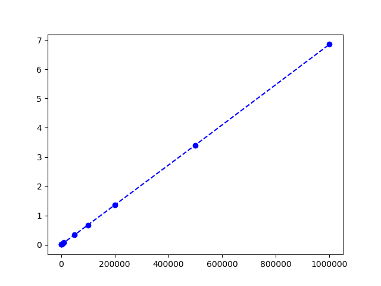
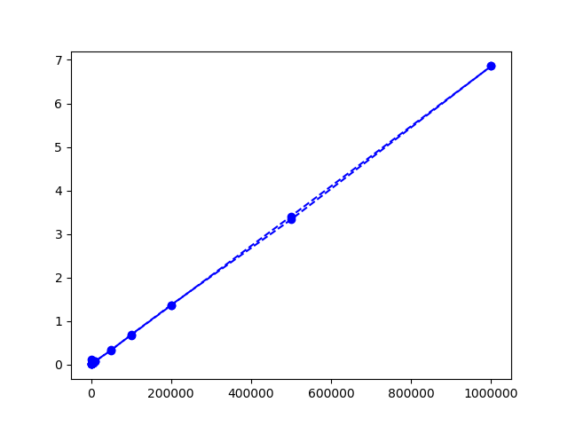
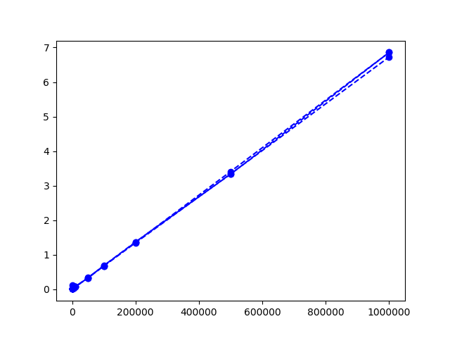

# Assignment

## Abstract

Sorting is one of the fundamental operations in Computer Science.
However, some sorting algorithms can perform much better than others
depending on factors such as: number of elements, order of elements.
In this report, a comparative performance evaluation of
three sorting algorithms Heap-Sort, Quick-Sort and Merge-Sort will be
presented depending on the number of elements while the orders
are generated uniformly randomly.

## Machine Details

### Hardware
```
OS:         macOS Catalina, version 10.15.1 (19B88)
Machine:    MacBook Pro (13-inch, 2017, Two Thunderbolt 3 ports)
Processor:  2.3 GHz Dual-Core Intel Core i5
Memory:     8 GB 2133 MHz LPDDR3
Graphics:   Intel Iris Plus Graphics 640 1536 MB
```

### Software
```
Languages:  Python (3.6.9); C++ (clang-1100.0.33.8);

```

## Running

1. Clone this repo and move to this directory.
2. Run `$ ./run.sh` and make sure it terminates with no errors.
3. Make sure you have `>= python 3.6` installed on your machine.
4. Run `$ ./visuals.py`.

## Generated Input Details

Files with randomly generated numbers were created at the beginning
of the evaluation. Namely:

```
  100
  500
  1000
  5000
  10000
  50000
  100000
  200000
  500000
  1000000
```
elements were generated.

For more info, see the contents of `/tests` folder.

## Performance Comparison

Heap Sorts Performance:



Merge Sorts Performance:



Quick Sorts Performance:



## Results

My sort implementations turned out really close in terms of runtimes for generated inputs.
However, the *Quick Sort* was the fastest by slightly less than **1/10th** of a second.
